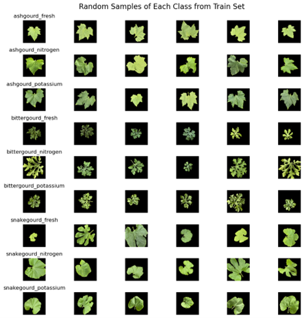

# Deep Learning Model for Early Detection of Plant Nutritional Deficiencies

## Overview
This project focuses on developing a **deep learning-based approach** for the **early detection of nitrogen and potassium deficiencies** in cucurbit crops such as ash gourd, bitter gourd, and snake gourd. The model utilizes advanced **image preprocessing techniques** combined with the **InceptionResNetV2 architecture** to improve classification accuracy.

## Objectives
- Develop a **deep learning classification model** for identifying nitrogen and potassium deficiencies in cucurbit crops.
- Improve **feature extraction** using advanced **preprocessing techniques** such as **Laplacian of Gaussian (LoG)** and **Canny Edge Detection**.
- Implement **data augmentation** to enhance dataset variability and model robustness.
- Fine-tune the **InceptionResNetV2 model** using hyperparameter optimization.
- Evaluate the model's performance using accuracy, loss, and classification metrics.

## Dataset
The dataset is sourced from **Kaggle** ([Early Nutrient Stress Detection of Plants](https://www.kaggle.com/datasets/raiaone/early-nutrient-stress-detection-of-plants)). It consists of **2,700 high-resolution images**.

## Methodology
### 1. Data Preprocessing
- **Laplacian of Gaussian (LoG):** Enhances structural details like venation and fine leaf textures.
- **Canny Edge Detection:** Identifies major edges and boundaries for improved feature extraction.
- **Combination of LoG & Canny:** Merges fine-grained textures with prominent edge features for optimal feature representation.

### 2. Data Augmentation
- Applied **rotation, flipping, and zooming** to increase dataset variability and model generalization.

### 3. Model Development
- Utilised **InceptionResNetV2** with **pre-trained ImageNet weights**.
- Added **custom fully connected layers** for domain-specific feature learning.
- **Fine-tuned** the model with optimal **learning rate, dropout rate, and layer freezing**.

### 4. Evaluation Metrics
- **Accuracy & Loss Curves**
- **Precision, Recall, and F1-score**
- **Confusion Matrix & Classification Report**

## Results
| Model | Test Accuracy | Test Loss |
|--------|-------------|----------|
| **CNN (without preprocessing)** | 51.0% | 3.24 |
| **CNN (with preprocessing)** | 87.0% | 0.95 |
| **InceptionResNetV2 (without preprocessing)** | 82.0% | 1.26 |
| **InceptionResNetV2 (with preprocessing)** | **98.7%** | **0.45** |

### Comparison of Test Accuracy and Test Loss
The following bar chart compares the test accuracy and test loss of different models used in this study. It demonstrates the impact of preprocessing and model selection on performance.


### Classification Report
The classification report presents the precision, recall, and F1-score for each category, showcasing the model's strong ability to classify different types of leaf conditions with high accuracy.


### Training and Validation Performance
The following plots illustrate the model’s training and validation accuracy and loss over epochs, highlighting its learning progression and convergence.


- The **model** (InceptionResNetV2 with preprocessing) achieved the **highest accuracy (98.7%)** and the **lowest test loss (0.45)**.
- **Preprocessing techniques** significantly improved the classification accuracy and feature extraction quality.

## Installation & Usage
### Prerequisites
Ensure the following dependencies are installed:
```bash
pip install tensorflow keras numpy matplotlib scikit-image scikit-learn
```

## Contributors

Poojith Poosa.
